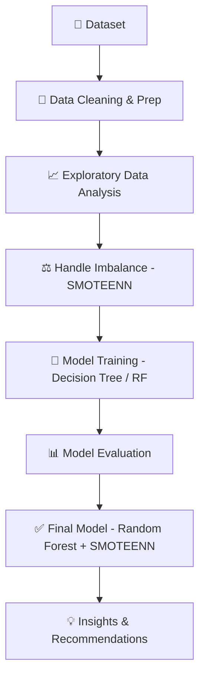

# 📞 Telco Customer Churn Analysis

---

## 📊 Project Overview

This project analyzes **customer churn behavior** at a fictional telecom company, **TelcoCorp**. Using **EDA** and **Machine Learning**, the aim is to **identify churn drivers** and build a **predictive model** to reduce churn.

---

## 🎯 Objectives

* Explore customer demographics, services, and billing details.
* Identify **key churn factors**.
* Build a **predictive model** with high recall for churned customers.
* Recommend **data-driven retention strategies**.

---

## 🧰 Tools & Technologies

* **Python** | **Pandas** | **NumPy** | **Matplotlib** | **Seaborn**
* **Scikit-learn** | **imblearn (SMOTEENN)** | **Pickle**
* **Jupyter Notebook** | **VS Code**

---

## 📂 Dataset

* **Source**: IBM Sample Dataset (Public)
* **File**: `WA_Fn-UseC_-Telco-Customer-Churn.csv`
* **Rows**: 7,043 | **Columns**: 21

**Features:**

* 👤 Demographics (Gender, SeniorCitizen, etc.)
* 🛠️ Services (Internet, OnlineSecurity, TechSupport, etc.)
* 💳 Billing (MonthlyCharges, TotalCharges, PaymentMethod)
* 🎯 Target → **Churn (Yes/No)**

---

## 🧹 Data Cleaning

✔ Converted `TotalCharges` → numeric
✔ Filled missing values
✔ Removed irrelevant columns (`customerID`)
✔ Encoded categorical features
✔ Balanced dataset using **SMOTEENN**

---

## 📈 Key Insights (EDA)

* 📉 **Churn Rate**: \~26.5%
* 💳 **Electronic Check** users churn most.
* 📆 **Month-to-Month contracts** → higher churn risk.
* 🔐 No **Online Security/Tech Support** → higher churn.
* 💰 High **MonthlyCharges + short tenure** → churn risk.
* 👥 Younger customers churn more than seniors.

---

## 🧠 Business Recommendations

* 💳 Encourage **Auto-Payments** to reduce churn.
* 📆 Offer **discounts on annual contracts**.
* 🛠️ Bundle **Online Security + Tech Support** services.
* 👩‍💼 Launch **engagement campaigns for younger customers**.

---

## 🤖 Model Building

### Data Prep

* Train-test split
* Class imbalance handled with **SMOTEENN**

### Models Tested

* **Decision Tree** → 78% accuracy (imbalanced), 93% with SMOTEENN
* **Random Forest** → **94.27% accuracy, 0.96 recall (best model)**
* **PCA** → 72% accuracy (discarded)

### Final Model

✅ **Random Forest + SMOTEENN**
✅ Saved using **Pickle (`model.sav`)**

---

## 📊 Results & Business Impact

* Predictive model detects **96% of churned customers**.
* Insights drive strategies to reduce churn:

  * Push auto-payments
  * Promote yearly contracts
  * Add bundled services
  * Focus on younger user retention

📌 **Impact** → Proactive strategies can **reduce churn, retain high-value customers, and save millions in revenue**.

---

## 🛠️ Project Workflow

---

✨ This project demonstrates how **EDA + Machine Learning** can empower telecoms to proactively reduce churn and boost customer loyalty.

